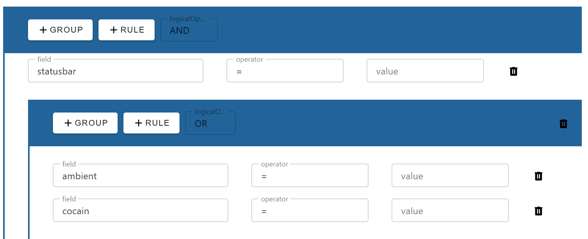

# Vue.js 3 Query Builder

A flexible and customizable query builder component for Vue.js 3, designed to work seamlessly with Vuetify. Create complex, nested queries using a simple and intuitive UI.

Effortlessly build advanced filtering logic with support for grouping, multiple operators, and diverse field types. The component is highly extensible, making it easy to tailor the user experience and appearance to your project’s requirements. With a focus on usability and performance, this query builder is ideal for dashboards, admin panels, and any application that needs advanced search or filtering capabilities.


---

## Installation

Install the package via npm:

```bash
npm install @vuejs3/vuetify-query-builder
```

---

## Basic Usage

Import and register the component in your Vue 3 application. Supports both the Options API and Composition API.

### 1. Using the Options API

```vue
<template>
  <query-builder v-model="filter" :filter-fields="filterFields" :color="color" />
</template>

<script>
import QueryBuilder from '@vuejs3/vuetify-query-builder'
import '@vue/vuetify-query-builder/dist/style.css'

export default {
  components: { QueryBuilder },
  data() {
    return {
      filter: {},
      filterFields: ['id', 'name', 'date', 'gender'],
      color: 'royalblue'
    }
  }
}
</script>
```

### 2. Using the Composition API

```vue
<template>
  <query-builder v-model="query" :filter-fields="filterFields" :color="color" />
</template>

<script setup>
import QueryBuilder from '@vuejs3/vuetify-query-builder'
import '@vue/vuetify-query-builder/dist/style.css'
import { ref } from 'vue'

const query = ref({})
const filterFields = ['id', 'name', 'date', 'gender']
const color = 'royalblue'
</script>
```

---

## Props

| Prop           | Type                         | Required | Default     | Description                                                        |
| -------------- | ----------------------------| -------- | ----------- | ------------------------------------------------------------------ |
| `modelValue`   | `object` or `Query`         | Yes      | `{}`        | The current query object (for v-model binding).                    |
| `filterFields` | `Array<string>`             | Yes      | `[]`        | List of fields available for filtering.                            |
| `color`        | `string`                    | No       | primary     | Color theme for the component. Uses your project's primary color by default. |

### Query Format

The value bound to `v-model` should match this interface:

```ts
interface Query {
  logicalOperator: 'AND' | 'OR'
  children: Array<Query | QueryRule>
}

interface QueryRule {
  rule?: string
  operator: string // e.g. '=', '!=', '>', etc.
  operand: string
  value: Array<string | number> | string | number | null
}
```

---

## Example Query Object

```json
{
  "logicalOperator": "AND",
  "children": [
    {
      "rule": "name",
      "operator": "=",
      "operand": "name",
      "value": "John"
    },
    {
      "logicalOperator": "OR",
      "children": [
        {
          "rule": "age",
          "operator": ">",
          "operand": "age",
          "value": 30
        },
        {
          "rule": "gender",
          "operator": "=",
          "operand": "gender",
          "value": "male"
        }
      ]
    }
  ]
}
```

---

## Screenshot





---


---

## Credits

Developed and maintained by Harshal Birari / use for Zensar 
